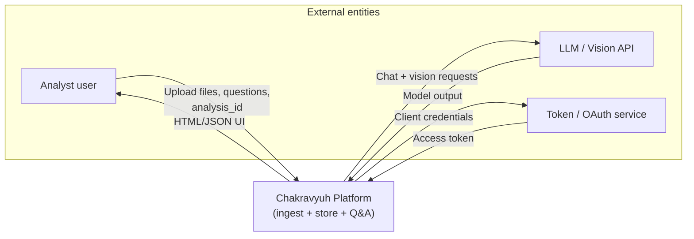
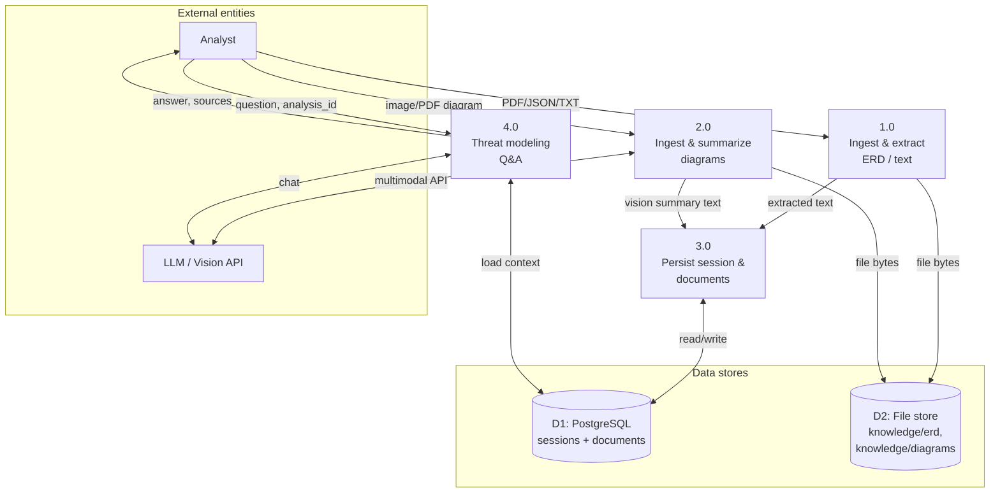
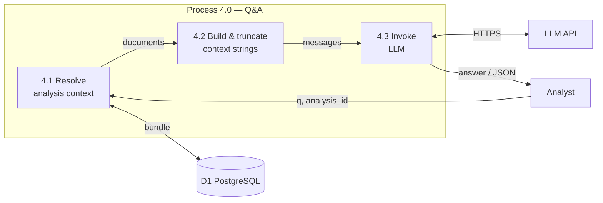
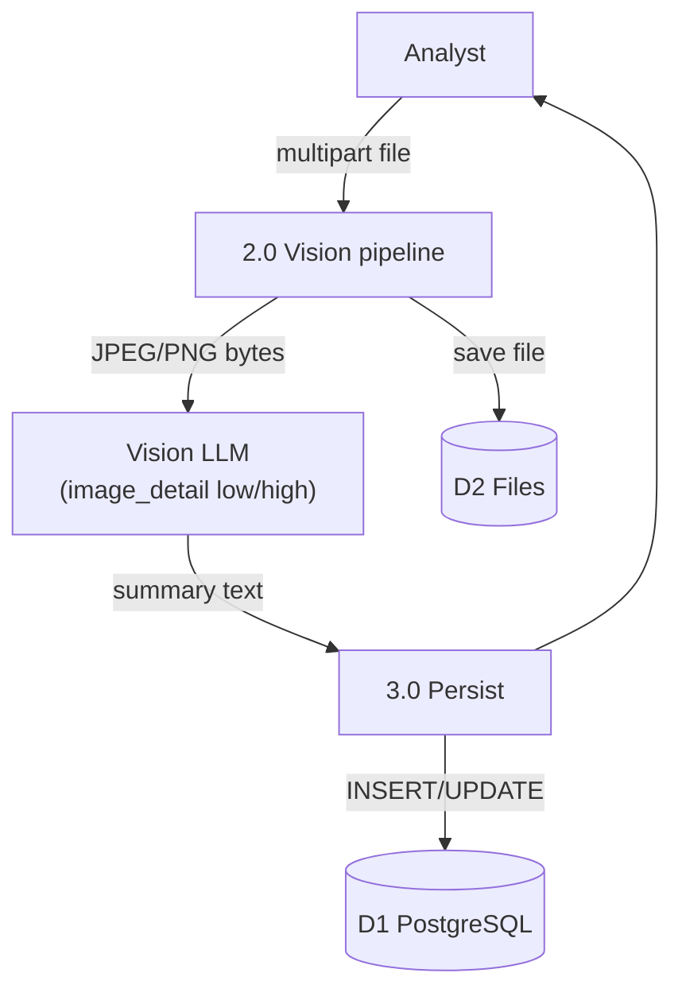

# Data Flow Diagrams (DFD)

Notation: **External entity** = square-corner box; **Process** = rounded rectangle; **Data store** = open rectangle; **Data flow** = labeled arrow. Diagrams use Mermaid for rendering in GitHub / many Markdown viewers.

---

## Level 0 — Context (system as a single process)

Shows the system boundary and external interactions.

**Flows summary**

| From | To | Data |
|------|-----|------|
| Analyst | Platform | ERD/supporting files, diagram files, questions, `analysis_id` |
| Platform | Analyst | Chat answers, structured threat JSON, readiness status |
| Platform | LLM | Prompts, image payloads (diagram summary), text context |
| LLM | Platform | Answer text, structured fields |
| Platform | Token service | OAuth client credentials (env) |
| Token service | Platform | Bearer token for gateway |

---

## Level 1 — Major processes

Decomposes the platform into logical processes and data stores.

**Process catalog**

| ID | Name | Description |
|----|------|-------------|
| 1.0 | Ingest & extract ERD/text | PDF/JSON/TXT → extracted string; optional OCR path from config |
| 2.0 | Ingest & summarize diagrams | Image/PDF page → raster/resize → vision LLM → plain-text summary |
| 3.0 | Persist session & documents | Writes/updates `analysis_sessions`, `analysis_documents`; links file paths |
| 4.0 | Threat modeling Q&A | Loads bundle for `analysis_id`, packs context, invokes chat LLM (CIA/AAA playbook) |

---

## Level 2 — Q&A process (4.0 detail)

**Internal data flows**

| Flow | Data |
|------|------|
| To 4.1 | `analysis_id` (optional → latest session) |
| 4.1 → 4.2 | List of `{ kind, filename, content_text }` plus legacy session fields |
| 4.2 → 4.3 | System + user messages; context chunks labeled by doc type (ERD / supporting / diagram) |
| 4.3 → User | `{ answer, sources }` or structured `ThreatModelReport` |

**Caching:** In-process bundle cache in `qa_chain` (TTL) reduces repeated DB reads for the same `analysis_id`.

---

## Level 2 — Diagram upload process (2.0 + 3.0)

---

## Data dictionary (selected)

| Data | Description |
|------|-------------|
| `analysis_id` | UUID string for an `analysis_sessions` row; ties uploads and chat |
| `erd_text` | Extracted plain text from ERD/supporting uploads |
| `architecture_diagram_summary` | Text summary from vision model (and/or aggregated from `diagram_vision` docs) |
| `content_text` | Row in `analysis_documents` — full text for that chunk (ERD, supporting, or diagram summary) |
| `ready_for_chat` | Derived: has text + diagram content per `GET /api/analysis-status` rules |

---

## Related documents

- [HLD.md](./HLD.md) — containers and trust boundaries
- [LLD.md](./LLD.md) — modules and APIs
