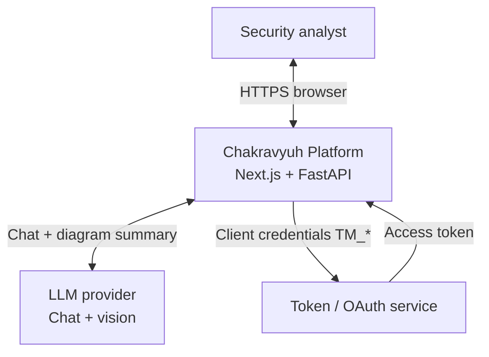
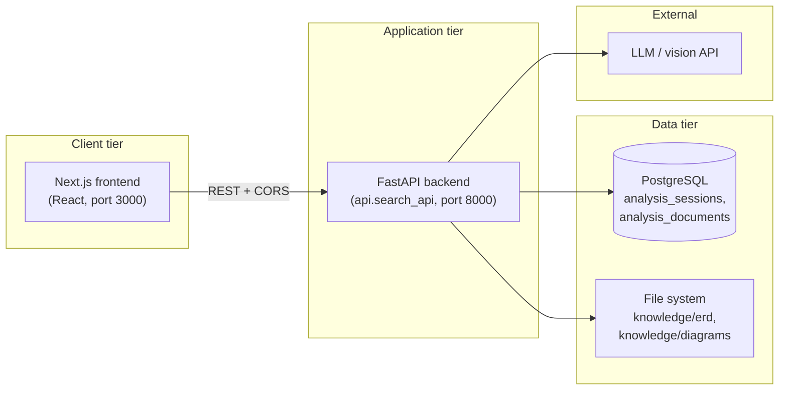

# High-Level Design (HLD)

## 1. Purpose

Web application for **security threat modeling** aligned with a **CIA / AAA** review playbook. Analysts upload **ERD and supporting documents** (PDF, JSON, TXT) and **architecture diagrams** (images/PDF). The system **persists extracted text and diagram summaries**, then answers questions via a **chat LLM** scoped to an **`analysis_id`** (analysis session).

## 2. System context

## 3. Logical containers

| Container | Responsibility |
|-----------|----------------|
| **Next.js frontend** | Upload flows, session/`analysis_id` handling, chat UI, guided prompts, calls backend API |
| **FastAPI backend** | ERD/diagram processing, persistence, **Q&A** (`/ask`), health, optional metrics |
| **PostgreSQL** | Session metadata, multi-document rows (`analysis_documents`), optional legacy `doc_hashes` |
| **Local knowledge dirs** | Original uploaded files under `knowledge/erd` and `knowledge/diagrams` |
| **LLM provider** | Text chat + **vision** summary for diagrams; credentials via env (`TM_*`, `OPENAI_API_KEY`, etc.) |

## 4. Deployment views

### 4.1 Local development

- **Frontend:** `npm run dev` (workspace) → Next.js on port **3000**
- **Backend:** `make api` / `uvicorn api.search_api:app` → port **8000**
- **Database:** PostgreSQL on localhost (or Docker) — `PG_*` env vars

### 4.2 Docker Compose (see `docker-prod/`)

- **db:** PostgreSQL (+ pgvector image; vector features may be unused by current app path)
- **backend:** image runs `uvicorn api.search_api:app`; mounts **`config.yaml`** and **`./data/knowledge` → `/app/knowledge`**
- **frontend:** Next.js production build
- **ollama:** optional; embeddings path is legacy for bulk RAG — **current Q&A does not require vector search**

## 5. Trust boundaries

| Boundary | Controls |
|----------|----------|
| Browser ↔ API | CORS allowlist (local dev hosts); prefer same-origin reverse proxy in production |
| API ↔ DB | Connection string via env; least-privilege DB user |
| API ↔ LLM | TLS; **no secrets in repo** — `TM_API_CLIENT_ID`, `TM_API_CLIENT_SECRET`, `TM_TOKEN_URL`, keys in env or mounted config |
| Uploaded files | Size limits on uploads; diagram vision uses resized images; files stored under `knowledge/` |

## 6. Non-goals (current product)

- **Semantic / vector search** over a global corpus (removed; endpoint returns 410)
- **Real-time collaboration** on sessions
- **Built-in IdP** — authentication is outside this HLD unless extended

## 7. Related documents

- [LLD.md](./LLD.md) — module and API detail
- [DFD.md](./DFD.md) — data flows
