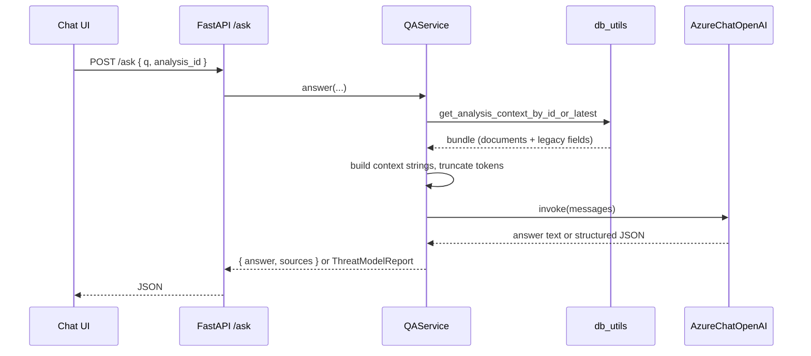

# Low-Level Design (LLD)

## 1. Repository layout (relevant parts)

```
threat-model/
├── frontend/                 # Next.js 15 app
│   └── src/
│       ├── app/              # page.tsx, layout
│       ├── components/     # erd-upload, chat-interface, layout, ui
│       └── lib/              # api-base, guided-prompts, utils
├── backend/
│   ├── api/
│   │   ├── search_api.py     # FastAPI app factory, /ask, /health, mounts erd_router
│   │   └── erd_processor.py  # /api/* upload & analysis session routes
│   ├── qa/
│   │   └── qa_chain.py       # QAService, CIA/AAA playbook, context assembly
│   ├── services/
│   │   ├── erd_extraction.py # PDF hybrid text extraction (+ OCR config)
│   │   └── diagram_vision.py # Resize → multimodal LLM summary
│   └── utils/
│       ├── config_loader.py
│       ├── db_utils.py       # PostgreSQL, analysis_sessions / analysis_documents
│       ├── llm_provider.py   # AzureChatOpenAI / ChatOpenAI, embeddings helpers
│       ├── tokenizer.py      # Token budget for context packing
│       └── metrics.py        # GET /metrics
└── docker-prod/              # Compose, Dockerfiles, initdb
```

## 2. Backend application

### 2.1 Entry point

- **ASGI app:** `api.search_api:app`
- **Router prefix:** `erd_processor.router` mounted at **`/api`**

### 2.2 Core modules

| Module | Role |
|--------|------|
| `search_api` | CORS, LangSmith env (optional), `AskRequest`, `_run_ask` → `QAService`, `/threat-modeling` (structured), `/health`, `/metrics`, deprecated stubs |
| `erd_processor` | Multipart uploads, `knowledge/erd` & `knowledge/diagrams`, calls `erd_extraction` / `diagram_vision`, `db_utils` append/upsert, `clear_analysis_cache` after writes |
| `qa_chain` | `QAService.answer`: load bundle by `analysis_id`, build LangChain `Document` list, token-truncate context, invoke LLM (plain or `ThreatModelReport` JSON) |
| `db_utils` | `get_conn()`, ensure tables, `analysis_sessions`, `analysis_documents`, `get_analysis_context_bundle`, `append_analysis_document`, etc. |
| `llm_provider` | `get_llm`, `get_embeddings` (embeddings unused by current Q&A path) |
| `diagram_vision` | `summarize_diagram_image`, `rasterize_pdf_first_page`; `vision.image_detail` (`low`/`high`) |

### 2.3 Key API surface

**Chat / analysis**

| Method | Path | Description |
|--------|------|-------------|
| GET/POST | `/ask` | Primary Q&A; `analysis_id` scopes context |
| GET | `/threat-modeling` | Same pipeline with `structured=True` (JSON schema) |

**Uploads & session (prefix `/api`)**

| Area | Examples |
|------|----------|
| Session | `POST /api/create-analysis-session`, `GET /api/analysis-status`, `GET /api/session-documents` |
| ERD / text | `POST /api/process-erd`, `POST /api/append-text-document`, `POST /api/save-original-erd` |
| Diagrams | `POST /api/process-architecture-diagram`, `POST /api/append-architecture-diagram` |

**Ops**

| Path | Role |
|------|------|
| `/health` | DB ping + LLM init check |
| `/metrics` | In-process metrics summary |
| `/api/embedding-status` | Stub “embeddings disabled” for UI compatibility |

### 2.4 Data model (logical)

**`analysis_sessions`**

- `id` (UUID PK)
- `erd_filename`, `erd_file_path`, `erd_text`
- `diagram_filename`, `diagram_file_path`, `architecture_diagram_summary`
- `created_at`, `updated_at`

**`analysis_documents`** (multi-file flow)

- `analysis_session_id` → `analysis_sessions.id`
- `kind`: `erd_text` | `supporting_text` | `diagram_vision`
- `filename`, `content_text`, `sort_order`, `created_at`

Session row aggregates can be refreshed from documents via `refresh_session_aggregates_conn`.

**Legacy:** `doc_hashes` — optional; not required for current upload/Q&A path.

### 2.5 Frontend

| Piece | Role |
|-------|------|
| `lib/api-base.ts` | Backend base URL (`NEXT_PUBLIC_BACKEND_API_URL`) |
| `components/erd-upload.tsx` | Multi-file upload, `analysis_id`, polling `analysis-status` |
| `components/chat-interface.tsx` | POST `/ask` with `analysisId`, guided prompts |
| `lib/guided-prompts.ts` | CIA/AAA-oriented quick prompts |

## 3. Sequence: Q&A (simplified)



## 4. Configuration

- **`backend/config.yaml`** (or mounted path in Docker): `provider`, `azure_openai` / `openai`, `vision`, `ocr`, `api_credentials` placeholders; secrets overridden by **`TM_*`** / **`OPENAI_API_KEY`** env vars as implemented in `llm_provider.py`.

## 5. Related documents

- [HLD.md](./HLD.md) — system context
- [DFD.md](./DFD.md) — data flows
